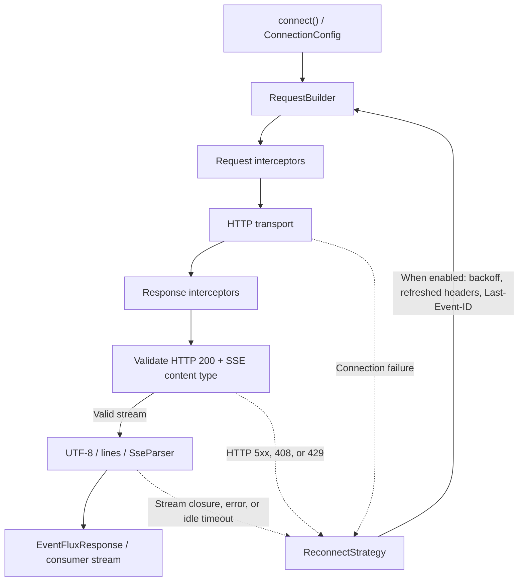

# EventFlux

Dart/Flutter client for Server-Sent Events (SSE), published as `eventflux` on pub.dev. It supports GET/POST streams, multipart requests, interceptors, reconnection, cancellation, and browser transport.

## Architecture

Consumers import `package:eventflux/eventflux.dart`. `EventFlux.instance` provides one shared client; `EventFlux.spawn()` creates an independent client with its own connection, parser, and reconnect state.

| Source | Responsibility |
| --- | --- |
| `lib/client.dart` | Owns connection status, HTTP client, stream controller/subscription, idle timer, and lifecycle callbacks; coordinates the internal modules. |
| `lib/src/connection_config.dart` | Bundles connection parameters and creates copies with refreshed headers for reconnects. |
| `lib/src/request_builder.dart` | Builds standard or multipart requests and their abortable variants. Standard bodies are JSON-encoded; multipart bodies become form fields. |
| `lib/src/sse_parser.dart` | Accumulates SSE lines into events and tracks the last event ID and server retry interval. |
| `lib/src/reconnect_strategy.dart` | Owns retry attempts, linear/exponential delay, jitter, and exponential backoff state. Uses callbacks rather than depending on `EventFlux`. |
| `lib/src/interceptor_runner.dart` | Runs request, response, and error interceptor chains in order. |
| `lib/models/` and `lib/enum.dart` | Public data, response, exception, interceptor, reconnect, web configuration, and status types. |
| `lib/http_client_adapter.dart` | Transport interface for caller-provided HTTP clients. |
| `lib/extensions/fetch_client_extension.dart` | Converts `WebConfig` into a browser `FetchClient`. |
| `lib/eventflux.dart` | Public exports; internal `lib/src/` modules are not exported. |

## Connection and event flow

1. `connect()` checks the platform and connection state, builds a `ConnectionConfig`, and starts the connection. Calls during an active or pending connection are ignored.
2. `RequestBuilder` creates the request. Request interceptors run before it is sent through the supplied `HttpClientAdapter` or the default client.
3. Response interceptors run before validation. A successful SSE connection requires HTTP 200 and a content type containing `text/event-stream`.
4. Response bytes pass through `Utf8Decoder`, `LineSplitter`, and `SseParser`. Completed events enter the client's single-subscription `StreamController<EventFluxData>`.
5. `onSuccessCallback` receives an `EventFluxResponse` exposing that stream. `response.where(eventType)` filters it by the SSE event name.

### Parser and lifecycle state

- Blank lines delimit events. Multiple `data:` lines are joined with newlines, with the final newline removed when dispatched.
- The parser retains `lastEventId` across automatic reconnects. Explicit disconnect calls `fullReset()`, clearing it for a subsequent connection.
- Numeric `retry:` fields are parsed as durations and forwarded to the reconnect strategy. `Last-Event-ID` is added to reconnect requests when available.
- Event delivery checks that the controller exists and is open. Teardown clears controller/subscription references before cancelling and closing them, protecting late callbacks during disconnect.
- Explicit disconnect clears reconnect configuration. Retry scheduling checks the disconnect flag after header refresh and again after the delay.
- The idle timer resets on every received line, including heartbeat comments. Expiry stops the connection and requests a reconnect when enabled.

### Reconnection and errors

`ReconnectConfig` controls attempts, delay mode, exponential `maxBackoff`, optional idle timeout, and asynchronous header refresh. Delays include jitter; successful connections reset attempt/backoff state.

Among HTTP error responses, 5xx, 408, and 429 are eligible for reconnect. Connection errors, stream errors, stream closure, and idle timeout also enter the reconnect path. Reconnect still requires `autoReconnect` and configuration. `EventFluxException` carries response details and optional original error/stack trace; error interceptors can suppress the consumer error callback by returning `null`.

### Native and browser transport

The default native transport is `package:http`'s `Client`; browsers use `fetch_client`. Web connections require `WebConfig`. Browser requests remove `Cache-Control` headers and use `WebConfig.cache` instead. `abortTrigger` selects abortable HTTP request types; custom adapters provide their own transport behavior.

## Tests and package tooling

| Purpose | Command |
| --- | --- |
| Dependencies | `flutter pub get` |
| Static analysis | `flutter analyze` |
| Default test suite | `flutter test` |
| VM integration suite | `flutter test test/integration/eventflux_test_vm.dart` |
| Browser suite | `flutter test test/browser --platform chrome` |
| Package validation | `flutter pub publish --dry-run` |

The VM integration filename does not end in `_test.dart`, so it needs the explicit command. Browser tests use browser-only annotations and require Chrome. Tests for individual internal modules live in `test/src/`; client lifecycle tests live in `test/client_test.dart`.

`test/mocks.mocks.dart` is generated from `test/mocks.dart` for `HttpClientAdapter`. Regenerate it with `dart run build_runner build --delete-conflicting-outputs` when that interface changes.

`pubspec.yaml` defines current SDK/dependency constraints. `README.md` contains public API examples and migration notes; `CHANGELOG.md` records release changes. `.github/workflows/continuous-integration.yaml` defines analysis, tests, and coverage checks.
