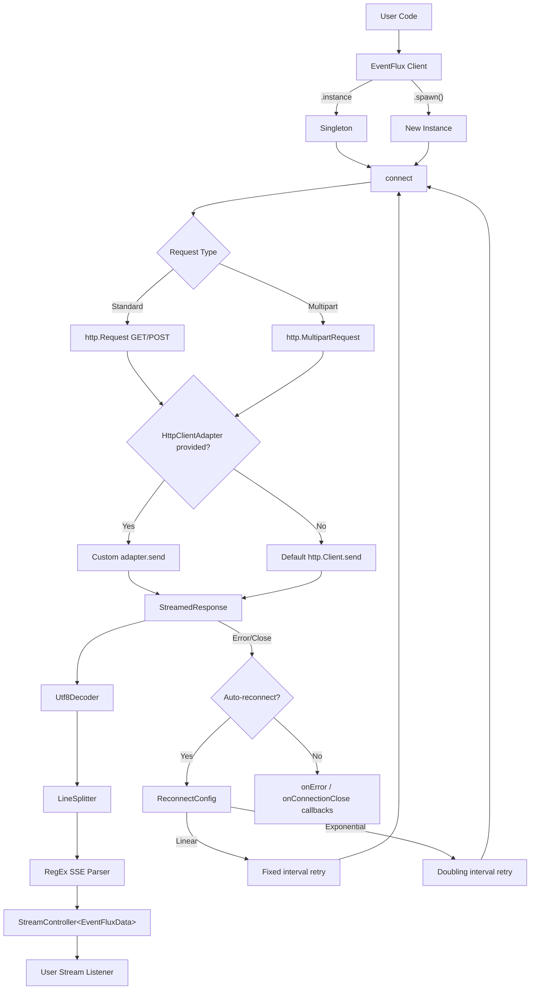

# CLAUDE.md

This file provides guidance to Claude Code (claude.ai/code) when working with code in this repository.

## Project Overview

EventFlux is a Dart/Flutter package for handling Server-Sent Event (SSE) streams. It provides connectivity, auto-reconnection (linear/exponential backoff), multipart request support, and pluggable HTTP clients. Published on pub.dev as `eventflux`.

## Development Commands

```bash
# Install dependencies
flutter pub get

# Run tests
flutter test

# Run a single test file
flutter test test/eventflux_test.dart

# Static analysis / linting (uses flutter_lints)
flutter analyze

# Publish to pub.dev (dry run)
flutter pub publish --dry-run
```

## Architecture



### Key Source Files

| File | Purpose |
|------|---------|
| `lib/client.dart` | Core EventFlux implementation — connection, SSE parsing, reconnection logic |
| `lib/models/base.dart` | `EventFluxBase` abstract class defining `connect()`/`disconnect()` contract |
| `lib/models/reconnect.dart` | `ReconnectConfig` and `ReconnectMode` enum (linear/exponential) |
| `lib/models/data.dart` | `EventFluxData` — parsed SSE event with `id`, `event`, `data` fields |
| `lib/models/response.dart` | `EventFluxResponse` — wraps status, stream, and error |
| `lib/models/exception.dart` | `EventFluxException` with message, statusCode, reasonPhrase |
| `lib/http_client_adapter.dart` | Abstract `HttpClientAdapter` interface for custom HTTP clients |
| `lib/enum.dart` | `EventFluxConnectionType` (get/post), `EventFluxStatus` enums |

### Design Patterns

- **Singleton + Factory**: `EventFlux.instance` for single connection, `EventFlux.spawn()` for multiple independent connections
- **Adapter pattern**: `HttpClientAdapter` allows swapping the underlying HTTP client
- **Stream-based**: All SSE events flow through a `StreamController<EventFluxData>` to the consumer
- **Explicit disconnect flag**: `_isExplicitDisconnect` in `client.dart` prevents auto-reconnect when the user calls `disconnect()` manually

### SSE Parsing

The SSE parser in `client.dart` uses the regex `r'^([^:]*)(?::)?(?: )?(.*)?$'` to parse each line into field/value pairs. It accumulates `event`, `data`, and `id` fields across lines and emits a complete `EventFluxData` object when it encounters an empty line (per the SSE spec).

## CI

GitHub Actions workflow at `.github/workflows/continuous-integration.yaml` uses `VeryGoodOpenSource/very_good_workflows` for linting, testing, and coverage on push/PR to `main`.
