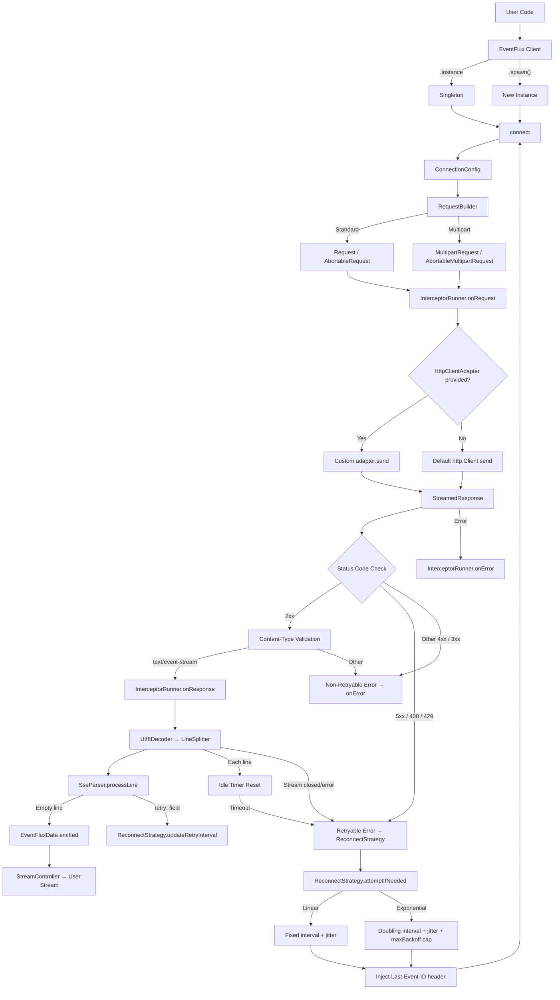

# CLAUDE.md

This file provides guidance to Claude Code (claude.ai/code) when working with code in this repository.

## Project Overview

EventFlux is a Dart/Flutter package for handling Server-Sent Event (SSE) streams. It provides WHATWG SSE spec-compliant parsing, interceptor chains, auto-reconnection with jitter and exponential backoff, abort support, idle timeout detection, web platform support (`fetch_client`), multipart request support, and pluggable HTTP clients. Published on pub.dev as `eventflux`.

**v3.0.0** requires Dart SDK `>=3.4.0` and Flutter `>=3.0.0`.

## Development Commands

```bash
# Install dependencies
flutter pub get

# Run tests
flutter test

# Run a single test file
flutter test test/client_test.dart

# Static analysis / linting (uses flutter_lints)
flutter analyze

# Publish to pub.dev (dry run)
flutter pub publish --dry-run
```

## Architecture



### Key Source Files

| File | Purpose |
|------|---------|
| `lib/client.dart` | Core `EventFlux` class — connection lifecycle, error classification, idle timeout, reconnect orchestration |
| `lib/src/sse_parser.dart` | `SseParser` — WHATWG-compliant SSE line parser with persistent `lastEventId`, `retry:` field, trailing `\n` strip, NULL check |
| `lib/src/reconnect_strategy.dart` | `ReconnectStrategy` — backoff management with jitter (0–25%), `maxBackoff` cap, server `retry:` override, attempt tracking |
| `lib/src/connection_config.dart` | `ConnectionConfig` — immutable bundle of all `connect()` parameters with `copyWithHeader()` for reconnect |
| `lib/src/request_builder.dart` | `RequestBuilder` — stateless factory producing `Request`, `MultipartRequest`, or their `Abortable` variants |
| `lib/src/interceptor_runner.dart` | `InterceptorRunner` — stateless executor for `onRequest` → `onResponse` → `onError` interceptor chains |
| `lib/models/interceptor.dart` | `EventFluxInterceptor` abstract class — override `onRequest`, `onResponse`, `onError` (return `null` to suppress) |
| `lib/models/base.dart` | `EventFluxBase` abstract class defining `connect()`/`disconnect()` contract |
| `lib/models/reconnect.dart` | `ReconnectConfig` (with `maxBackoff`, `connectionTimeout`) and `ReconnectMode` enum (linear/exponential) |
| `lib/models/data.dart` | `EventFluxData` — parsed SSE event with `id`, `event`, `data` fields and `json` getter |
| `lib/models/response.dart` | `EventFluxResponse` — wraps status, stream, error; `where(eventType)` filters by event name |
| `lib/models/exception.dart` | `EventFluxException` with `message`, `statusCode`, `reasonPhrase`, `originalError`, `stackTrace` |
| `lib/models/web_config/` | `WebConfig` and enums (`WebConfigRequestMode`, `WebConfigRequestCredentials`, etc.) for web platform |
| `lib/extensions/fetch_client_extension.dart` | `FetchClientExtension` — converts `WebConfig` to `FetchClient` for web SSE support |
| `lib/http_client_adapter.dart` | Abstract `HttpClientAdapter` interface for custom HTTP clients |
| `lib/enum.dart` | `EventFluxConnectionType` (get/post), `EventFluxStatus` (connected, reconnecting, disconnected, error, connectionInitiated) |
| `lib/eventflux.dart` | Barrel file exporting the public API |

### Design Patterns

- **Singleton + Factory**: `EventFlux.instance` for single connection, `EventFlux.spawn()` for multiple independent connections
- **Internal `src/` extraction**: Public API lives in `lib/`, implementation details in `lib/src/` — `SseParser`, `ReconnectStrategy`, `ConnectionConfig`, `RequestBuilder`, `InterceptorRunner` are not exported
- **Adapter pattern**: `HttpClientAdapter` allows swapping the underlying HTTP client
- **Stream-based**: All SSE events flow through a `StreamController<EventFluxData>` to the consumer
- **Interceptor chain**: `onRequest` → send → `onResponse` / `onError` lifecycle with error suppression (return `null` from `onError` to suppress)
- **Error classification**: Only 5xx, 408, and 429 status codes trigger auto-reconnect; other errors surface via `onError`
- **Explicit disconnect flag**: `_isExplicitDisconnect` in `client.dart` prevents auto-reconnect when the user calls `disconnect()` manually

### SSE Parsing

The `SseParser` class (`lib/src/sse_parser.dart`) handles WHATWG-compliant SSE line parsing:

- Uses regex `r'^([^:]*)(?::)?(?: )?(.*)?$'` to parse each line into field/value pairs
- Accumulates `event`, `data`, and `id` fields across lines and emits a complete `EventFluxData` on empty line (event boundary)
- **Persistent `lastEventId`**: Survives `reset()` calls across reconnections (per WHATWG spec)
- **`retry:` field parsing**: Numeric-only millisecond values forwarded to `ReconnectStrategy`
- **Trailing `\n` stripping**: Removes trailing newline from accumulated `data` before dispatch
- **NULL character check**: Ignores `id:` values containing `\u0000`
- **U+2028 sanitization**: Strips line separator characters that would break regex parsing

### Reconnection

Reconnection is managed by `ReconnectStrategy` (`lib/src/reconnect_strategy.dart`) and orchestrated from `client.dart`:

- **Error classification**: Only 5xx, 408 (Request Timeout), and 429 (Too Many Requests) trigger auto-reconnect. Other status codes (4xx, 3xx) are treated as non-retryable errors
- **Linear mode**: Fixed interval with 0–25% random jitter
- **Exponential mode**: Doubling interval with 0–25% jitter, capped at `maxBackoff`
- **Server `retry:` override**: `SseParser` parses the SSE `retry:` field and updates `ReconnectStrategy` interval
- **`Last-Event-ID` header injection**: On reconnect, `_sseParser.lastEventId` is merged into request headers
- **Idle timeout** (`connectionTimeout`): Timer resets on every received line (including comments as heartbeats); on expiry, connection stops and reconnect is scheduled
- **`reconnecting` status**: `EventFluxStatus.reconnecting` is set during retry attempts
- **Attempt tracking**: `maxAttempts` limits retries (-1 = unlimited); `onReconnect(attempt, delay)` callback fires on each attempt
- **Double disconnect checks**: Strategy checks `_isExplicitDisconnect` both before header refresh and inside the delayed callback before reconnecting

### Abort Support

Connections can be cancelled mid-flight via the `abortTrigger` parameter on `connect()`:

- Pass a `Future<void>` (typically from a `Completer<void>`) as `abortTrigger`
- `RequestBuilder` wraps the request in `AbortableRequest` or `AbortableMultipartRequest` (from `http ^1.6.0`)
- When the future completes, the in-flight HTTP request is aborted

### Interceptors

The interceptor system (`EventFluxInterceptor` + `InterceptorRunner`) provides a chain of hooks around the request lifecycle:

- **`onRequest(BaseRequest)`**: Modify the request before sending (e.g., inject auth headers). Throw `EventFluxException` to abort the chain
- **`onResponse(StreamedResponse)`**: Inspect the response after receiving (status, headers). Must not consume the stream body
- **`onError(EventFluxException)`**: Filter or suppress errors. Return `null` to suppress the exception (prevents `onError` callback from firing)

Multiple interceptors run in sequence; each receives the output of the previous one.

## CI

GitHub Actions workflow at `.github/workflows/continuous-integration.yaml` uses `VeryGoodOpenSource/very_good_workflows` for linting, testing, and coverage on push/PR to `main`.
